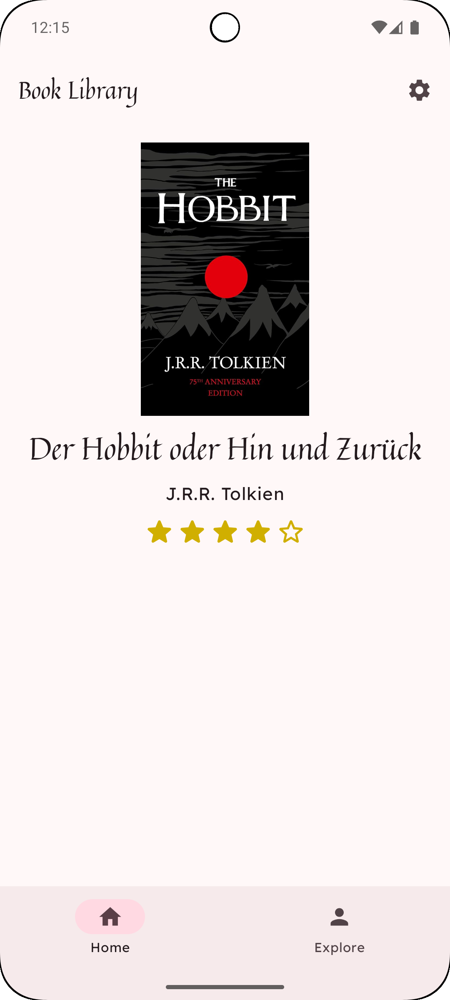

# Name der App

**Füge hier einen kurzen, knackigen Slogan ein, um deine App zu bewerben.**

Beschreibe hier in ein paar Sätzen, was deine App bietet.

Für wen ist sie geeignet? Welches Problem löst sie? Was macht deine App anders/besser als andere Apps?
Vermeide es, hier allzusehr in technische Details zu gehen.

## Design
Füge hier am Ende die Screenshots deiner App ein.

  
  
  

## Features
Hier kommen alle Features rein, welche deine App bietet.

**Tipp: Du kannst diese Punkte mit der Zeit abhaken, sodass am Ende eine vollständige Liste entsteht.**

- [x] Feature 1
- [x] Feature 2
- [ ] ...

## Technischer Aufbau

#### Projektaufbau
Eine kurze Beschreibung deiner Ordnerstruktur und Architektur (MVVM, Repositories) um Außenstehenden zu helfen, sich in deinem Projekt zurecht zu finden.

#### Datenspeicherung
Welche Daten speicherst du? Wo und wie (Firebase, Core Data)? Erkläre hier auch, warum du den jeweiligen Dienst nutzt (offline-first, Sync usw.).

#### API Calls
Welche APIs verwendest du?

#### 3rd-Party Frameworks
Verwendest du Frameworks/Libraries, die nicht von dir stammen?

## Ausblick
Beschreibe hier, wo die Reise nach deinem Praxisprojekt hin geht. Was möchtest du in Zukunft noch ergänzen?

- [ ] Geplantes Feature 1
- [ ] Geplantes Feature 2
- [ ] ...

# WhatsIn  
**Scanne. Erkenne. Entscheide bewusst.**

Mit WhatsIn erhältst du beim Scannen eines Produkts sofort Klarheit über Inhaltsstoffe, Allergene, Zuckeranteil – und sogar über den Konzern, zu dem die Marke gehört. So triffst du informierte Entscheidungen beim Einkaufen.

## 💡 Was bietet die App?

WhatsIn richtet sich an gesundheitsbewusste Menschen, Allergiker, Veganer – und alle, die wissen möchten, **was genau in einem Produkt steckt** und **wer dahintersteht**. Die App hilft dabei, Zutaten transparent zu machen und zu erkennen, ob ein Produkt z. B. Zucker, Gluten, Milchprodukte oder Palmöl enthält und ob es zu einem Konzern wie Nestlé oder Unilever gehört.

## 🎨 Design

*Screenshots*

## ✅ Features

- 📷 Produkt per Barcode scannen
- ℹ️ Detaillierte Produktinfos (Zutaten, Allergene, Labels, etc.) auf einen Blick
- ⚠️ Warnung nach dem Scannen bei Abweichung von benutzerdefinierten Filtern
- 📌 Verlauf und Favoriten speichern
- 🔍 Suchfunktion für gespeicherte Produkte
- 🔁 Offline-Zugriff nach erstem Scan

## 🧱 Technischer Aufbau

### Projektstruktur

Die App verwendet eine **saubere MVVM-Architektur** mit klar getrennten Schichten:

- `Model` → DTOs und Room-Entities
- `View` → Jetpack Compose-Screens
- `ViewModel` → Logik, Scans und Datenverarbeitung
- `Repository` → Verknüpft API, Room-Datenbank und Konzern-Mapping

### Datenspeicherung

- 📦 **Room-Datenbank** zur lokalen Speicherung gescannter Produkte und Favoriten
- 📁 **Lokale JSON-Datei** mit Zuordnung: Marke → Konzern; wird bei App-Start von Dropbox geladen und lokal gespeichert

### API Calls

-  [OpenFoodFacts API](https://world.openfoodfacts.org/)
-  [OpenBeautyFacts API](https://world.openbeautyfacts.org/)
→ Liefert Inhaltsstoffe, Labels und Zusatzinformationen zu gescannten Produkten (Lebensmittel & Kosmetik)

### 3rd-Party Libraries

- Retrofit - API-Anbindung
- Moshi - JSON-Parsing
- Room - lokale Datenbank
- Koin - Dependency Injection
- Jetpack Compose - moderne UI

## 🚀 Geplante Features

- Erweiterung auf Haushalts- und Reinigungsprodukt (OpenProductsFactsApi)
- Standortabhängige Produktempfehlungen
- Kartenansicht für gescannte Produkte (um zu sehen, wo welches Produkt gescannt wurde)
- Empfehlung von Alternativen auf Basis der gewählten Filter
- Mehrsprachigkeit
- Eigene Notizen („hat uns geschmeckt“, „komische Konsistenz“, etc.)
