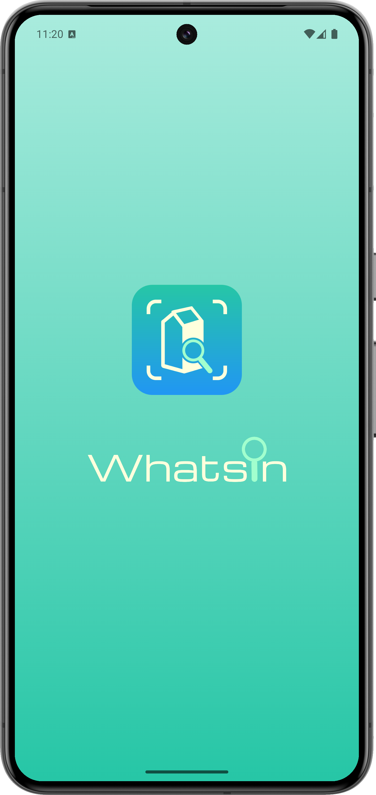
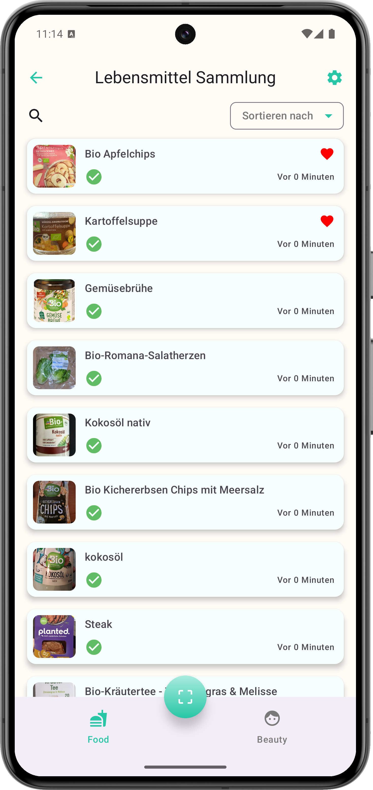
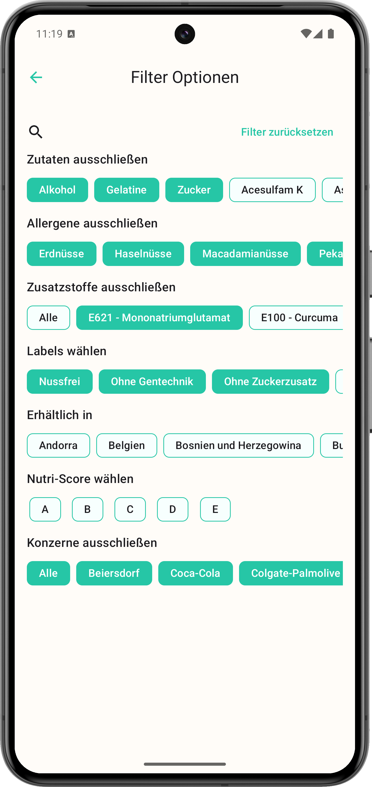

# WhatsIn  

*WhatsIn* ist eine App, mit der per einfachem Barcode-Scan sofort erkennbar wird, was wirklich in Lebensmitteln und Kosmetikprodukten steckt – von Inhaltsstoffen über Allergene bis hin zur Konzernzugehörigkeit.
Sie ist für alle gedacht, die beim Einkaufen genauer hinsehen – ob aus gesundheitlichen Gründen, aufgrund ihrer Ernährungsweise oder aus Überzeugung.
Anders als viele andere Apps prüft WhatsIn benutzerdefinierte Filter automatisch beim Scannen und warnt unmittelbar, wenn ein Produkt nicht den festgelegten Kriterien entspricht.
So hilft die App, informierte Entscheidungen direkt vor Ort zu treffen – schnell, transparent und individuell anpassbar.

## 🎨 Design

  
  
  
  

## ✅ Features

- 📷 Produkt per Barcode scannen
- ℹ️ Detaillierte Produktinfos (Zutaten, Allergene, Labels, etc.) auf einen Blick
- ⚠️ Warnung nach dem Scannen bei Abweichung von benutzerdefinierten Filtern
- 📌 Verlauf und Favoriten speichern
- 🔍 Suchfunktion für gespeicherte Produkte
- 🔁 Offline-Zugriff nach erstem Scan

## 🧱 Technischer Aufbau

### Projektstruktur

Die App verwendet eine **saubere MVVM-Architektur** mit klar getrennten Schichten:

- **Model** → DTOs und Room-Entities
- **View** → Jetpack Compose-Screens
- **ViewModel** → Logik, Scans und Datenverarbeitung
- **Repository** → Verknüpft API, Room-Datenbank und Konzern-Mapping

### Datenspeicherung

- 📦 **Room-Datenbank** zur lokalen Speicherung gescannter Produkte und Favoriten
- 📁 **Lokale JSON-Datei** mit Zuordnung: Marke → Konzern; wird bei App-Start von Dropbox geladen und lokal gespeichert

### API Calls

-  [OpenFoodFacts API](https://world.openfoodfacts.org/)
-  [OpenBeautyFacts API](https://world.openbeautyfacts.org/)
  
→ Liefern Inhaltsstoffe, Labels und Zusatzinformationen zu gescannten Produkten (Lebensmittel & Kosmetik)

### 3rd-Party Libraries

- Retrofit - API-Anbindung
- Moshi - JSON-Parsing
- Room - lokale Datenbank
- Koin - Dependency Injection
- Jetpack Compose - moderne UI

## 🚀 Geplante Features

- Erweiterung auf Haushalts- und Reinigungsprodukt (OpenProductsFactsApi)
- Standortabhängige Produktempfehlungen
- Kartenansicht für gescannte Produkte (um zu sehen, wo welches Produkt gescannt wurde)
- Empfehlung von Alternativen auf Basis der gewählten Filter
- Mehrsprachigkeit
- Eigene Notizen („hat uns geschmeckt“, „komische Konsistenz“, etc.)
